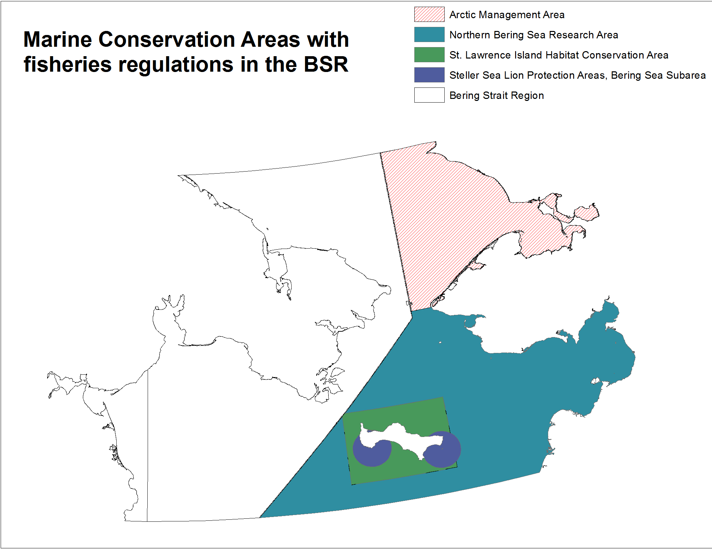

```{r setup, warning=F,message=F}

source('../../common.R')

# Libraries

library(tidyr)
library(reshape2)
library(rgeos)
```

Demersal destructive fishing does not occur on the US side of the BSR. No commercial fishing is allowed in the Arctic management area, and trawling has been prohibited since 2008 in the Northern Bering Sea Research Area. This tells us that no demersal destructive fishing takes place within the US EEZ.




##Bring in the demersal destructive fishing layer that has been updated for the Russian side.
```{r, warning=F,message=F}

    dem_d_rus = raster('working/dem_d_rus_catch.tif')
    
    plot(dem_d_rus,col=cols, main = 'Catch per cell (tons) for Russia \n updated with SAUP data')
```

##Turn all US EEZ values to 0
```{r US to zero, message=F,warning=F}
    
    us_eez <- readOGR(dsn=file.path(dir_arctic,'gis/bsr'),layer='USA_EEZ',verbose=F)

    dem_d_catch = rasterize(us_eez,dem_d_rus,0,update=TRUE)
    
    dem_d_catch[is.na(dem_d_catch)]<-0
    dem_d_catch = mask(dem_d_catch,bsr)

    plot(dem_d_catch,col=cols, main = 'Demersal Destructive Fishing \n Catch (tons) per cell')
    plot(bsr,add=T)
    plot(us_eez,add=T)

```  

***  

##Bring in productivity

```{r,message=F,warning=F}
    
  prod = raster('../productivity/output/five_yr_avg_09-13_bsr_laea.tif')

  plot(prod,col=cols)
    
```

Catch needs to be standardized by productivity
```{r,message=F,warning=F}

  catch_prod = dem_d_catch/prod

  plot(catch_prod,col=cols, main = 'Catch standardized by productivity')
  
  histogram(catch_prod)
  
```  

***  

##Rescale

```{r rescale,message=F,warning=F}
  
max = cellStats(catch_prod,stat='max')

dem_d_rescale = catch_prod/max

plot(dem_d_rescale,main='Demersal destructive bycatch fishing rescaled',col=cols)
plot(bsr,add=T)


writeRaster(dem_d_rescale,filename='output/dem_d_bsr_catch_prod(5yravg).tif',overwrite=T)

```
