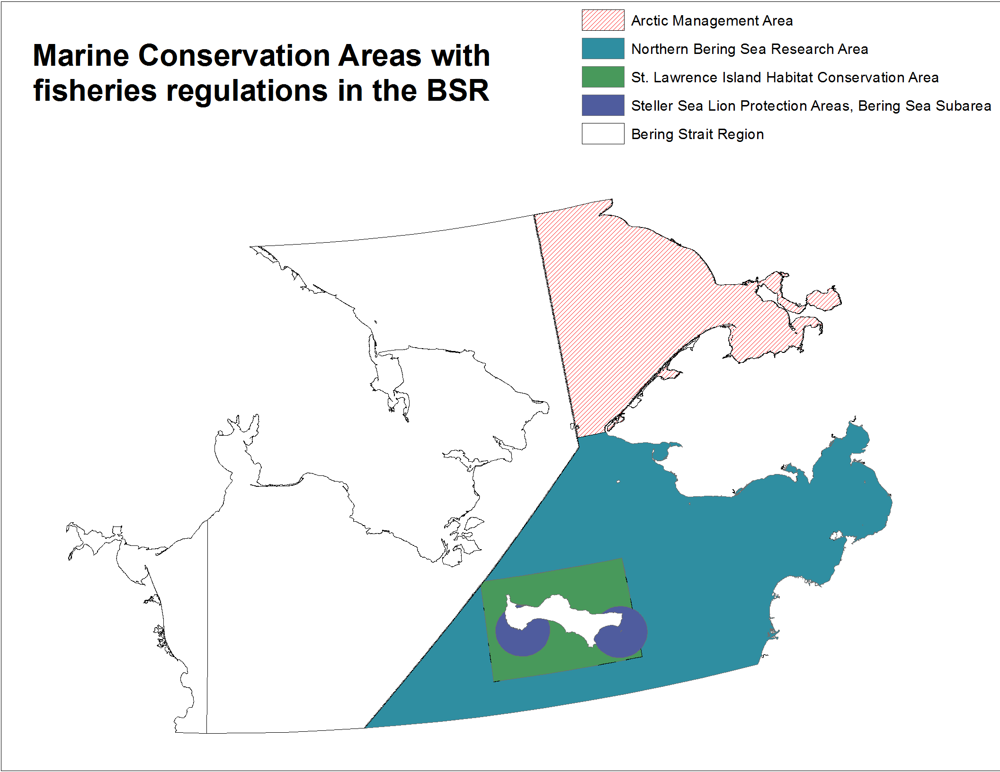

The commercial fishing stressor layers for Arctic Options were updated for the Bering Strait using knowledge of fishing activity in the region and data from NOAA and Alaska Department of Fish and Game. Data specific to the fishing activity taking place in Russian waters was not available, and therefore not updated from the 2013 global analysis.  

Definitions of gear type for all 5 types of commercial fishing. From Halpern et al. (2008) supplementary materials:  
  

*NOTE: Code is included below, but the majority is commented out due to large memory requirements and length of time needed to run much of the raster analysis. Instead, images and plots are read in to visualize the output rather than running the code while knitting this document.*

###Setup

```{r,message=FALSE,warning=FALSE}
# LIBRARIES

    library(rgdal)
    library(raster)
    library(maptools)
    library(dplyr)

#  SET WORKING DIRECTORY
    
    setwd('A:/HIACMS/CHI/bering-strait/stressors/commercial_fisheries')
    
# shapefiles   
    
#   bering sea shapefile
    bsr    <- readOGR(dsn='working',layer='bering_shoreline_laea',verbose=FALSE)

#   USA EEZ shapefile
    us_eez <- readOGR(dsn='working',layer='USA_EEZ',verbose=FALSE)
    
#   Get projection of bsr to use for rasters
    
    #crs(bsr) crs = coordinate reference system
    
#   Define projection (same as crs(bsr))
    
    laeacrs <- CRS(' +proj=laea +lat_0=90 +lon_0=180 +x_0=0 +y_0=0 +datum=WGS84 +units=m +no_defs +ellps=WGS84 +towgs84=0,0,0')

#   transform US EEZ projection to be the same as bsr
    
    us_eez <- spTransform(us_eez, laeacrs)
```
  
  
All global raster layers from the cumulative impact 2013 analysis found in `H:\mnt\storage\marine_threats\impact_layers_2013_redo\impact_layers\work\fishing` were brought into ArcGIS and reprojected into the Lambert Azimuthal Equal Area (WGS 1984 North Pole Bering Sea) projection then saved in `A:\HIACMS\CHI\bering-strait\stressors\commercial_fisheries\working` before clipping and manipulating in R as shown below.  
  
***
### Demersal Destructive Fishing  

The arctic management area is offlimits to commercial fishing until the North Pacific Fishery Mangement Council decides how to allow and manage fishing in this region.  


In 2008, the North Pacific Fishery Management Council implemented the Northern Bering Sea Research Area which prohibits bottom trawling.

  
  
    
    
The 2013 cumulative impact data layer for demersal destructive fishing in this region does not account for this non-activity as seen in the map below. This data is the raw data provided by the Sea Around us Project in 2008 (catch rate standardized by productivity) and updated with more recent global FAO landings data. More information on this data can be found in `N:\git-annex\Global\OHI_CHI_FishingData\fish_datacycle.html`

```{r,message=FALSE,warning=FALSE}
#    Grab global raster layer projected to LAEA

      dem_d_raw = raster('working/demersal_destructive_fishing_2013_raw_LAEA_proj.tif')

#    Clip global data to BSR region

      #dem_d_bsr <- mask(dem_d_raw,bsr,progress='text',filename='stressors/commercial_fisheries/working/demersal_destructive_fishing_2013_raw_BSR.tif')
      dem_d_bsr = raster('working/demersal_destructive_fishing_2013_raw_BSR.tif')

#    Look at map

#        zoom(dem_d_bsr,bsr,main='Demersal Destructive Fishing \nGlobal CHI data layer clipped to BSR') #zoom is used to zoom into extent of bsr
#        plot(bsr, add = TRUE)
#        plot(us_eez, add = TRUE)
```

  
    
    

Since there is no demersal destructive fishing permitted in US waters off of Alaska, all cell values intersecting with the US EEZ shapefile have been set to 0. All cell values for fishing in Russian waters are maintained:    

```{r,message=FALSE,warning=FALSE}

 # data_ras = rasterize(us_eez,dem_d_bsr,0,update=TRUE,progress='text',filename='stressors/commercial_fisheries/working/dem_d_bsr_us_update.tif')
   data_ras = raster('working/dem_d_bsr_us_update.tif')        

# plot to check values
          
  zoom(data_ras,bsr,main='Demersal destructive fishing in the BSR \n(tons per km2 per year)')
  plot(bsr,add=T)
  plot(us_eez,add=T)
```              
  
  
    
    

After updating the cells within US waters, the final data layer is produced by rescaling the values from 0 to 1:  
```{r,message=FALSE,warning=FALSE}
#   Rescale

#        dem_d_log = calc(data_ras,fun=function(x){log(x+1)},progress='text',filename = 'stressors/commercial_fisheries/working/dem_d_bsr_log.tif')
                        
#        max = maxValue(dem_d_log)

#        dem_d_rescale = dem_d_log/max
        
#        zoom(dem_d_rescale,bsr)
#        plot(bsr,add=T)

#    writeRaster(dem_d_rescale,filename='output/dem_d_bsr.tif')
    dem_d_rescale = raster('output/dem_d_bsr.tif')
```
  
  
    
***  

### Demersal non-destructive high bycatch fishing  

To the best of our knowledge, there are no demersal, non-destructive, high bycatch fisheries taking place in the US waters of the Bering Strait Region. All crab fisheries have very low bycatch and relatively little fishing is occuring in this region even for the directed crab fisheries. With this information we can again set all cells in the US EEZ to 0 while maintaining the values in Russian waters since there is no better information or data about these types of fisheries.  

Original data from 2013 global analysis:  
```{r,warning=FALSE,message=FALSE}
#    Grab global raster layer projected to LAEA

        #dem_nd_h_bc_raw = raster('working/demersal_nodest_high_bycatch_2013_raw_LAEA_proj.tif')
      

#    Clip global data to BSR region

        #dem_nd_h_bc_bsr <- mask(dem_nd_h_bc_raw,bsr,progress='text',filename='working/dem_nondest_high_bycatch_2013_raw_BSR.tif')

        dem_nd_h_bc_bsr = raster('working/dem_nondest_high_bycatch_2013_raw_BSR.tif')

#    Look at map

        zoom(dem_nd_h_bc_bsr,bsr) #zoom is used to zoom into extent of bsr

        #plot(bsr, add = TRUE)
        #plot(us_eez, add = TRUE)
```
  

Just as was done with demersal destructive fishing, all 1km cells within US EEZ set to 0:  
```{r,warning=FALSE,message=FALSE}
#     rasterize US_EEZ, value set = 0

     #dem_nd_h_bc_bsr_us = rasterize(us_eez,dem_nd_h_bc_bsr,0,update=TRUE,progress='text',filename='working/dem_nd_h_bc_bsr_us_update.tif')

      dem_nd_h_bc_bsr_us = raster('working/dem_nd_h_bc_bsr_us_update.tif')

#     plot to check values

        #zoom(dem_nd_h_bc_bsr_us,bsr)
        #plot(bsr,add=T)
        #plot(us_eez,add=T)
```
  

  
    
    
And the final stressor created by rescaling data from 0 to 1:  
```{r,warning=FALSE,message=FALSE}
#   Rescale

      #dem_nd_h_bc_log = calc(dem_nd_h_bc_bsr_us,fun=function(x){log(x+1)},progress='text',filename = 'working/dem_nd_hbc_bsr_log.tif')
      dem_nd_h_bc_log = raster('working/dem_nd_hbc_bsr_log.tif')
      
      #max = maxValue(dem_nd_h_bc_log)

      #dem_nd_hbc_rescale = dem_nd_h_bc_log/max

      #zoom(dem_nd_hbc_rescale,bsr)
      #plot(bsr,add=T)

      #writeRaster(rescale,filename='output/dem_nondest_highbc_bsr.tif')
```
  

***  

### Pelagic high bycatch fishing  

Similar to the previous 2 types of commercial fishing, this type of fishing does not take place in the US EEZ. Groundfish fisheries in the larger region might be classified as pelagic high bycatch, or potentially demersal nondestructive high bycatch due to the use of long lines set near or on the bottom. But through personal contact at Sustainable Fisheries - NOAA Alaska (specifically Josh Keaton),  we were able to confirm that no groundfish fisheries have reported catch from our region.  

The Alaska Pollock fishery and the herring fishery can also be considered pelagic fisheries, yet are not included in this category due to the lack of occurrence of both of these fisheries in our region. Again this was confirmed by Josh Keaton at NOAA. *Note that the Alaskan Pollock fishery is famously known to be low bycatch and therefore would be classified as pelagic, low bycatch if this fishery occured in our region.  


The lack of pelagic high bycatch fishing in the region is captured in the global data layer. As shown below, the raw data used in the global Cumulative Impacts analysis shows no fishing - all cells are equal to 0. This remains accurate to the best of our knowledge and therefore we do not need to make any updates to this data layer.  

```{r,warning=FALSE,message=FALSE}
#    Grab raster layer clipped to bsr

        #pel_hbc = raster('working/pelagic_high_bycatch_2013_raw_LAEA_proj.tif')

#    Clip global data to BSR region

        #pel_hbc_bsr <- mask(pel_hbc,bsr,progress='text',filename='working/pelagic_high_bycatch_2013_raw_BSR.tif')

#    Look at map

        #zoom(pel_hbc_bsr,bsr) 

        #plot(bsr, add = TRUE)
        #plot(us_eez, add = TRUE)

# NOTICE all values = 0. No need to recreate this stressor layer

#writeRaster(pel_hbc_bsr,filename='output/pelagic_highbc_bsr.tif')
```


