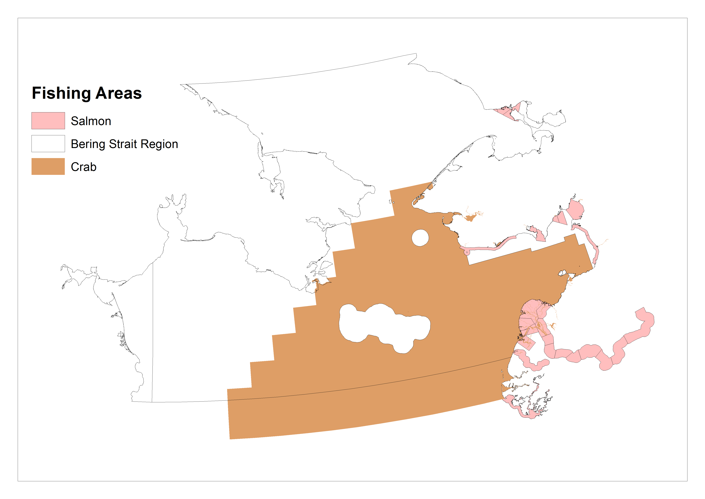
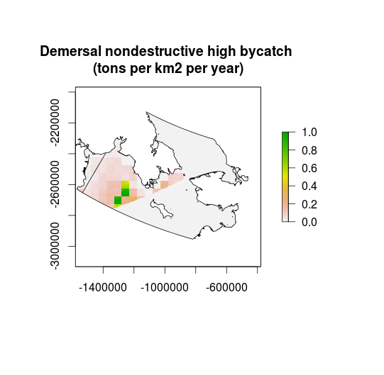

###Creating commercial fisheries pressure layers for the Bering Strait

Jamie Afflerbach  

***
We updated the global fishing layers with better data for US fisheries taking place within US and AK state waters in the Bering Strait. We have not been able to get better data for the fisheries taking place on the Russian Side of the BSR so we have kept the same catch rate data used by CHI in 2013, which is the original SAUP data from 2008 updated with new landings data from FAO to 2011.  

After communicating with [NMFS regional office](http://www.alaskafisheries.noaa.gov/) in AK and [Alaska Department of Fish and Game](http://www.adfg.alaska.gov/), it is clear that there is very little commercial fishing activity within the US EEZ of our Bering Strait Region. 

There is commercial salmon and crab fishing within state and national waters, both regulated by ADF&G, and some commercial halibut fishing managed by the International Pacific Halibut Commission.  

  

***
####SALMON

Catch data for our region for the years 2009-2013 comes from the [Alaska Commercial Fisheries Entry (CFEC)](http://www.cfec.state.ak.us/bit/mnusalm.htm). All salmon fishing in our region uses set gillnet and has low bycatch and can therefore be categorized as pelagic, low bycatch fishing.

***

####CRAB

The crab fishery in our region is managed by the State of Alaska but not restricted to state waters, as shown on the map of fishing areas. Data also comes from the [CFEC](http://www.cfec.state.ak.us/bit/mnucrab.htm)

***
####HALIBUT

Catch data for Halibut was provided for our region by the [International Pacific Halibut Commission](http://www.iphc.int/). Data was provided for IPHC statistical areas 4D and 4E between 62 and 66 degrees north for the years 2008-2013 (and earlier). These catch rates (tons/km2) were calculated then applied across the region.

Halibut fishing is the only type of demersal, non destructive, high bycatch fishing in US waters in the region.

***
####Productivity

In the global fishing layers developed by SAUP, productivity was used to standardize catch rates. When developing these fishing layers we wanted to incorporate more recent productivity data from [VGPM](http://orca.science.oregonstate.edu/1080.by.2160.monthly.hdf.vgpm.m.chl.m.sst4.php). The procedure provides more detail on how this data was used.